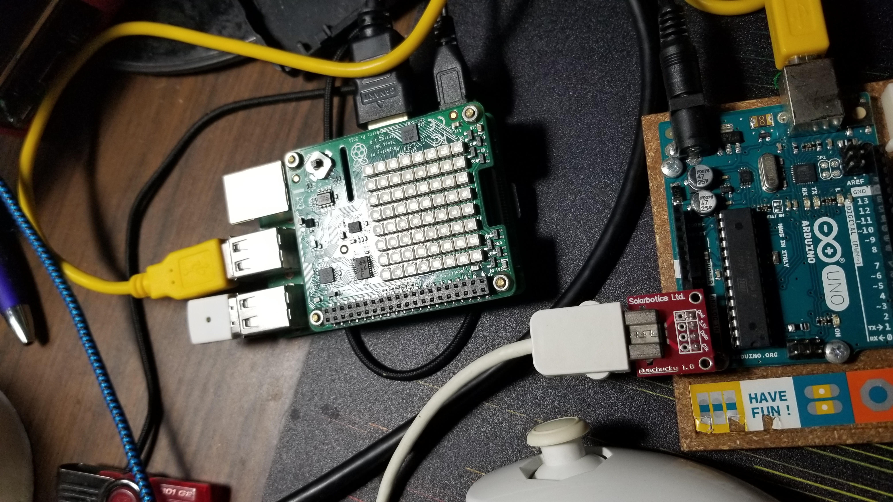

# Wii Nunchuk Mouse Program -- Use your Wii nunchuk as a computer mouse (for Linux/ Raspberry Pi)!

## First, You'll need:
* Raspberry Pi/ Linux computer with Arduino IDE installed
* This piece of hardware to connect the nunchuk to the Arduino ([buy it here](https://www.amazon.com/Adafruit-Nunchucky-Nunchuck-Breakout-Adapter/dp/B00NAY3N1G) -- you will need to solder on the pins yourself):

* An Arduino (I have an Arduino Uno)
* Python, installed with [pymouse](https://pypi.org/project/PyMouse/#files) and [pyserial](https://pythonhosted.org/pyserial/).

## Setup:
1. Connect the adapter to the Arduino as such:

2. Connect your nunchuk to the adapter:

3. Connect your Arduino to your raspberry pi (mine, below, has the sense hat equipped), or computer:

4. Using the Arduino IDE, upload the nunchuk_lines.ino sketch to the Arduino

5. Ensure the Arduino is running correctly with the new sketch uploaded

6. Run the nunchuk_tester.py file in the same directory as nunchuk.py on your raspberry pi, or computer

## Controls:
* **Joystick:** moves the mouse around
* **C:** Engages gyro controls as long as it's being held down
* **Z:** Right-click
* **Gyro controls (when C is held):** moves the mouse around

## Demo:
* [YouTube Demo Video](https://youtu.be/ExCjDEq3abY)
